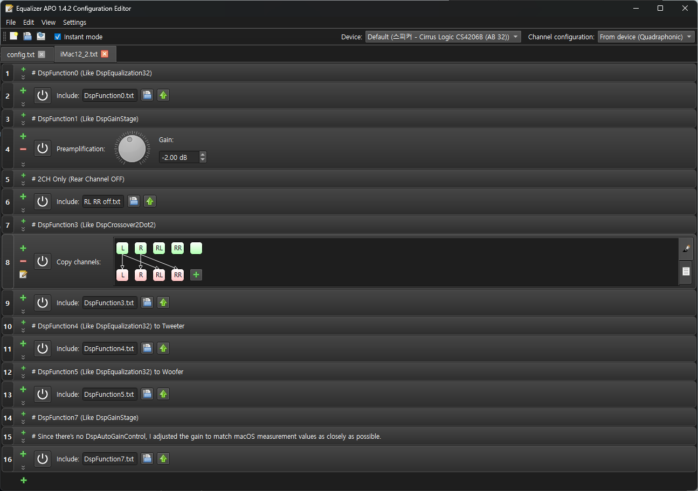
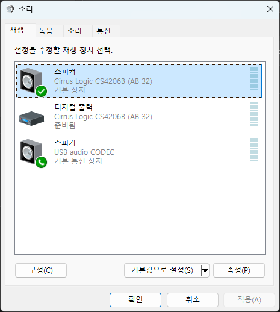
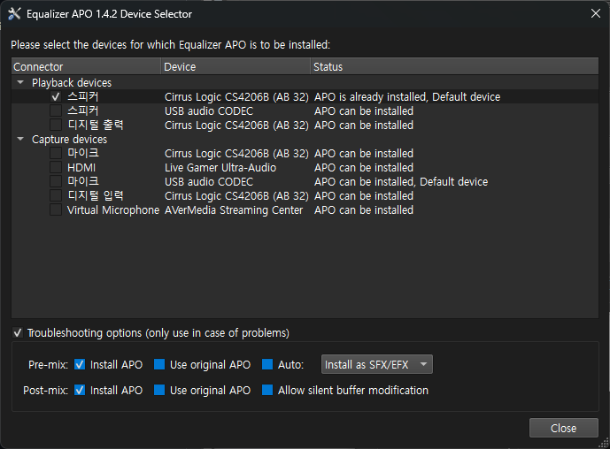
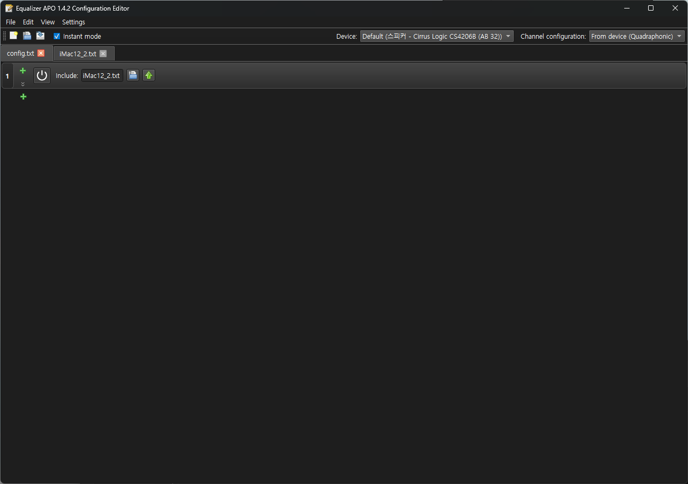

BootCamp Speaker Mod For iMac12,2
========

This mode is based on Equalizer APO.
[Equalizer APO Link](https://sourceforge.net/projects/equalizerapo/)

Additionally, the tuning values are based on my macOS AppleALC tuning values.
It does not use the default Apple stock tuning values!
Please be aware of this point, and [Click Here](https://github.com/NStevenU/AppleALC-for-iMac12-2) to view related information.

## Features

- Unlike macOS, BootCamp lacks software DSP, resulting in terrible sound quality, which this improves.
- Based on Equalizer APO.
- Equalizer APO supports Windows 7-11, so it's expected to work with all Windows versions supported by BootCamp

## Content

This is the original frequency response.
As you can see, unlike macOS which has built-in software DSP, Windows lacks it, resulting in very poor sound processing.
macOS uses the internal DSP for 2-way crossover, but Windows appears to have none of that.

  

* These measurement results are rough and approximate, so they include room characteristics (like dips) and are not precise.
For proper measurement results, refer to the my AppleALC for iMac12,2 patch article above.

I aimed to replicate macOS CoreAudio's DSP processing as closely as possible.
Features like AutoGainControl or SplineLimiter are absent, so they were omitted.

The EQ processing matches exactly what I created for macOS.
The output results are nearly identical.

## Installation

First, go to Sound Settings, then click Configure at the bottom left.

Select Quadraphonic for the audio channels. (If prompted to choose full-range or satellite, set only Front Left and Right to full-range.)

Next, install Equalizer APO. When the Device Selector appears, choose Speakers.
Select Troubleshooting options, then—as shown in the photo—uncheck "Use original APO" and "Auto," choose "Install as SFX/EFX," and finish.

Download the attached files (config.txt, DspFunction0, 3, 4, 5, 7.txt, RL RR off.txt, iMac12_2.txt).
Copy them to "C:\Program Files\EqualizerAPO\config."

Run Equalizer APO and confirm it's applied as shown in the photo. That's it.
